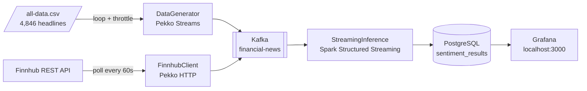
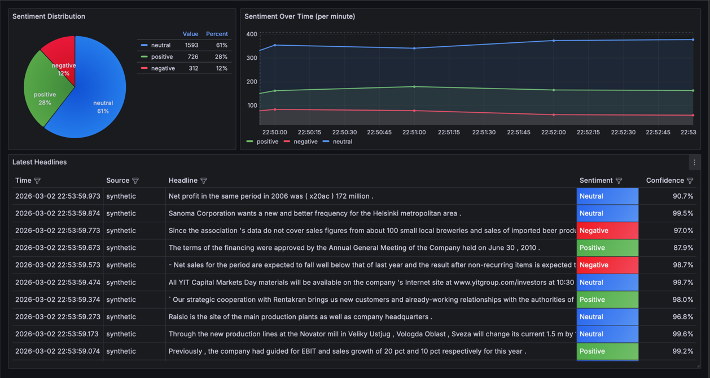

# Financial Sentiment Pipeline

A distributed real-time sentiment analysis pipeline for financial news headlines. Headlines are ingested from live and synthetic sources, classified by a Spark MLlib model, and displayed on a live Grafana dashboard.

The architecture demonstrates core distributed systems patterns — producer-consumer decoupling via Kafka, backpressure-aware streaming with Pekko, and the Spark ML Pipeline API used identically for batch training and streaming inference.

## Tech Stack

| Category | Technology |
|---|---|
| Language | Scala 2.13 |
| Build | sbt |
| ML Training | Apache Spark MLlib 3.5 |
| Streaming Inference | Spark Structured Streaming 3.5 |
| Message Broker | Apache Kafka (KRaft, no Zookeeper) |
| Ingestion | Apache Pekko + Pekko HTTP |
| Database | PostgreSQL 16 |
| Dashboard | Grafana 11 |
| Containers | Docker, Docker Compose |

## Architecture





## Key Components

**ModelTrainer** — Builds and fits a 6-stage Spark ML pipeline: RegexTokenizer → StopWordsRemover → HashingTF → IDF → StringIndexer → LogisticRegression. Trained on the [Kaggle Financial PhraseBank](https://www.kaggle.com/datasets/ankurzing/sentiment-analysis-for-financial-news) (4,846 labelled headlines). Achieves ~69% accuracy (~62% macro F1) on a held-out 20% split, with inverse-frequency class weights to counter the dataset's neutral-heavy imbalance. Saves the fitted `PipelineModel` to disk.

**StreamingInference** — Loads the saved `PipelineModel` and subscribes to the Kafka topic as a Spark Structured Streaming source. Processes micro-batches every 10 seconds via `foreachBatch`, writing `(headline, sentiment, confidence, ingestedAt, source)` to PostgreSQL.

**DataGenerator** — Synthetic ingestion source. Loops through all CSV headlines using `Source.cycle + throttle` (Pekko Streams) and publishes `MarketNews` JSON to Kafka at a configurable rate (default 10 msg/s). Useful for demos and load testing.

**FinnhubClient** — Live ingestion source. Polls the Finnhub `/api/v1/news` REST endpoint every 60 seconds using Pekko HTTP, deduplicates by article ID with `statefulMapConcat`, and publishes to the same Kafka topic. Both sources can run simultaneously.

**NewsKafkaProducer** — Thin Pekko Streams `Sink` wrapping the Java `KafkaProducer`. Shared by both ingestion sources.

## Running

```bash
# Copy the safe example config
cp src/main/resources/application.conf.example src/main/resources/application.conf

# Start Kafka, PostgreSQL, and Grafana
docker compose up -d

# Train the model (once — takes ~1 min on first run due to sbt downloading dependencies)
sbt 'runMain com.pipeline.training.ModelTrainer'

# Terminal 1 — Ingestion (choose one, or run both)
sbt 'runMain com.pipeline.generator.DataGenerator'
sbt 'runMain com.pipeline.ingestion.FinnhubClient'

# Terminal 2 — Streaming inference
sbt 'runMain com.pipeline.inference.StreamingInference'
```

Dashboard: [http://localhost:3000](http://localhost:3000) → Dashboards → Financial Sentiment Pipeline

```bash
# Teardown
docker compose down        # stop containers, keep data
docker compose down -v     # stop and wipe all data
```

## Configuration

The template for config is in `src/main/resources/application.conf.example`.

The example uses defaults (`pipeline/pipeline`) for the Docker PostgreSQL service. For live Finnhub ingestion, pass your token via environment variable:

```bash
FINNHUB_TOKEN=your_key sbt 'runMain com.pipeline.ingestion.FinnhubClient'
```

You can also override database settings without editing files:

```bash
DATABASE_URL='jdbc:postgresql://localhost:5432/sentiment' DATABASE_USER='pipeline' DATABASE_PASSWORD='pipeline' sbt 'runMain com.pipeline.inference.StreamingInference'
```

## Future Work

**FinBERT** — Replace the TF-IDF + LogisticRegression pipeline with [ProsusAI/finbert](https://huggingface.co/ProsusAI/finbert) via [spark-nlp](https://nlp.johnsnowlabs.com/). The pre-trained model is already fine-tuned on Financial PhraseBank and achieves ~85-90% accuracy. Because `StreamingInference` only calls `PipelineModel.load` and `model.transform`, the inference layer requires no changes — only `ModelTrainer` would be updated.
